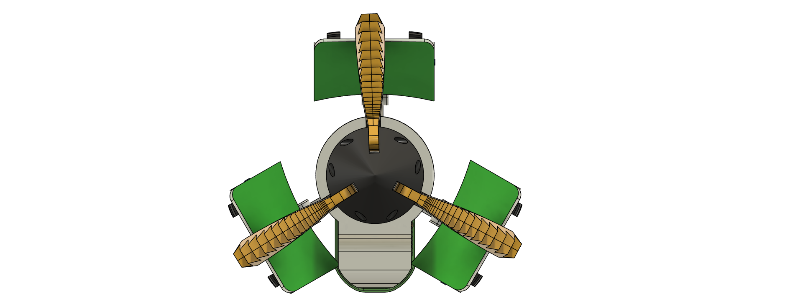
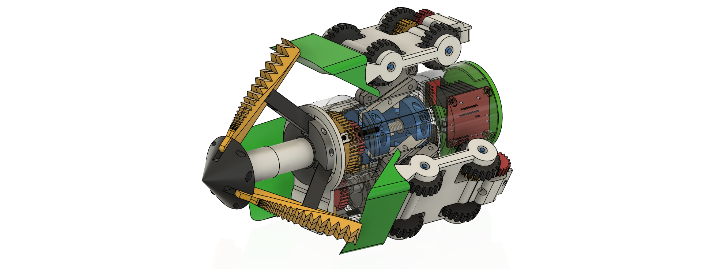
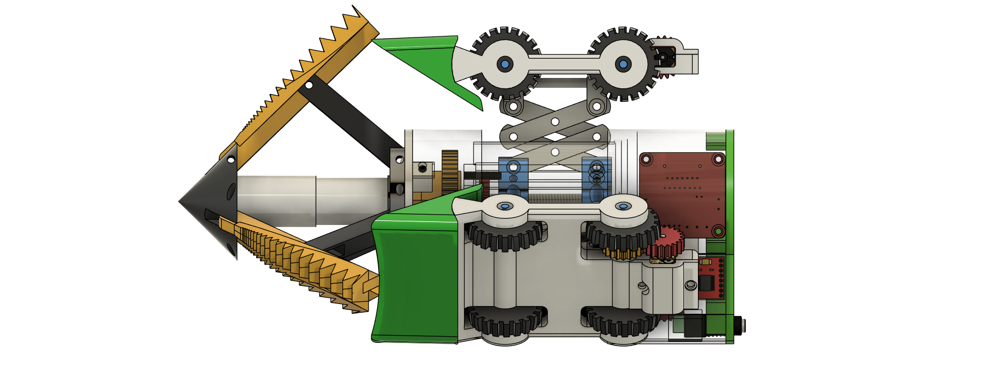
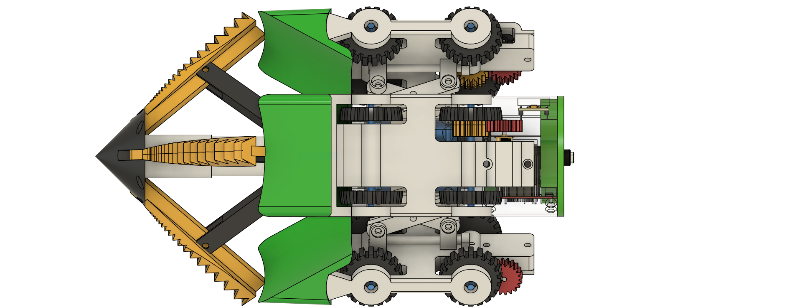
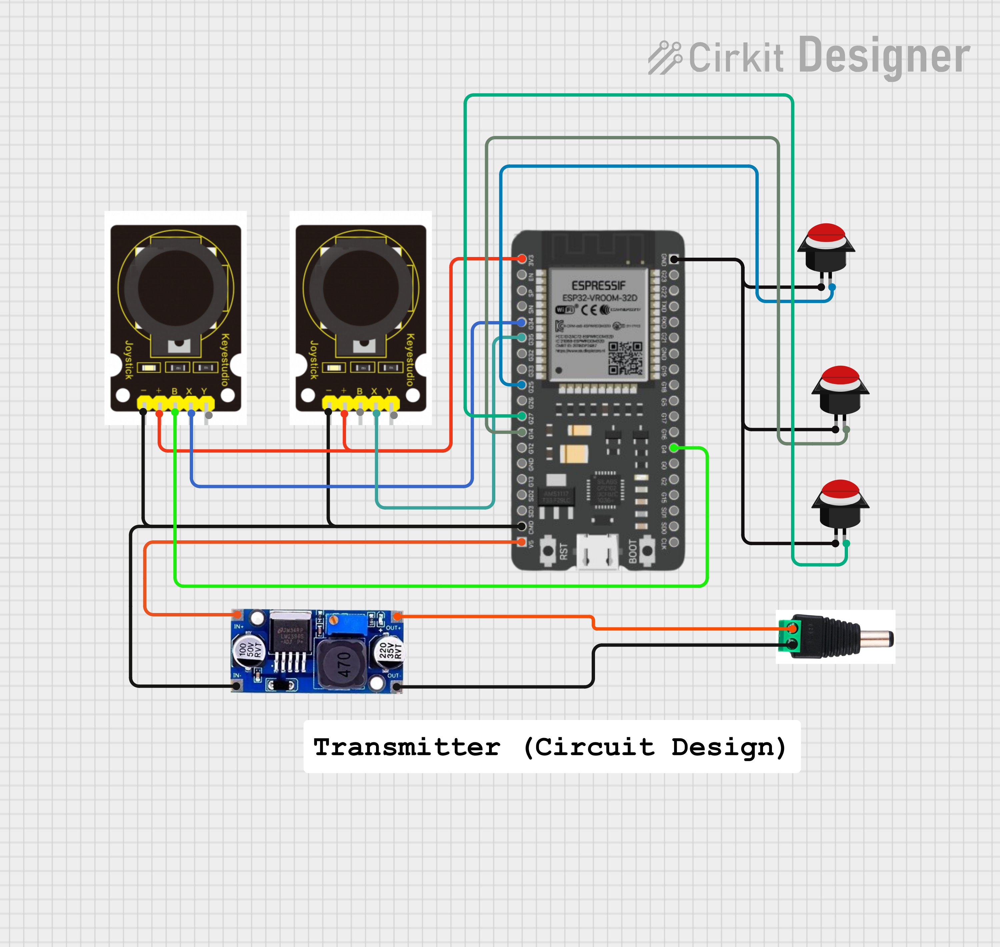
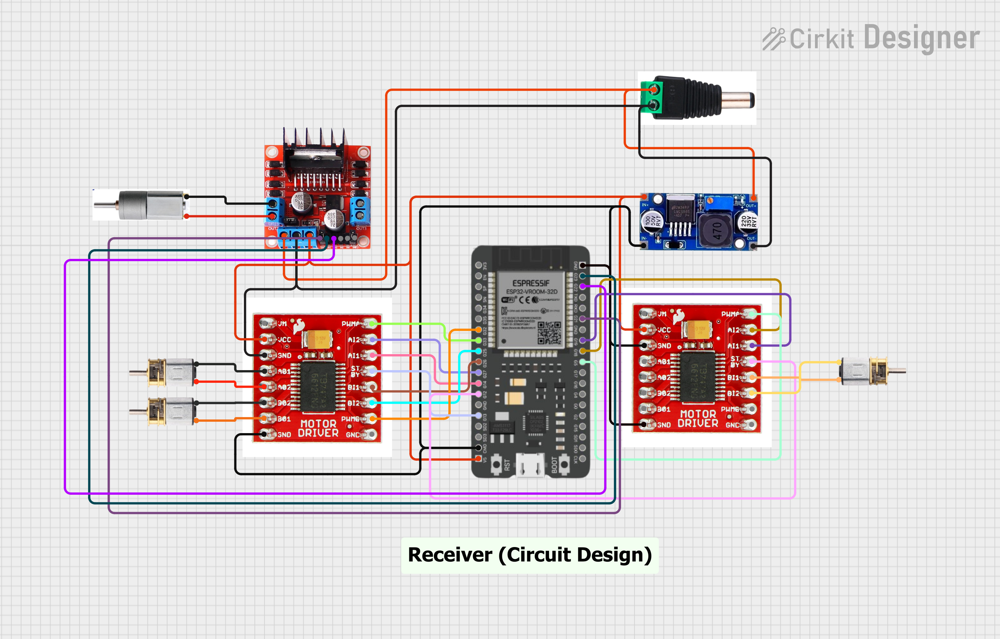
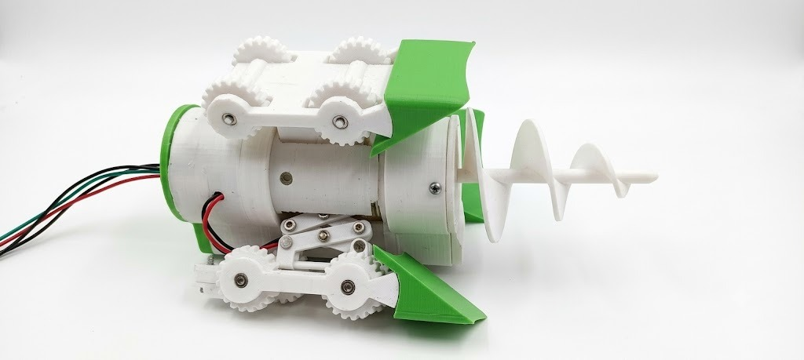
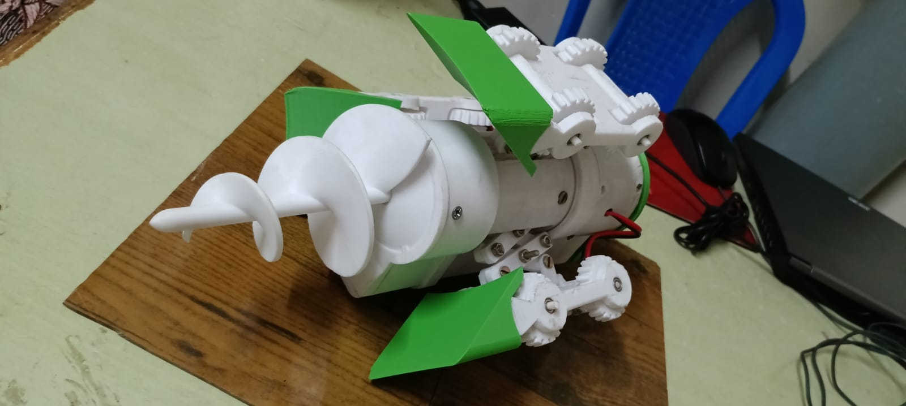

# SP-INNOVATORS

# IoT and Robotics-Based Sewage Manhole and Pipeline Cleaning Robot

## 🏆 Smart India Hackathon (SIH) Project

This repository contains the technical development and supporting resources for our Smart India Hackathon (SIH) project.

It documents the development of the proposed robotic system through:

- 🤖 Robotic prototype development
- 📐 CAD design
- 🔌 Electronic circuit design
- 💻 Embedded software
- 📡 Wireless control system
- 📷 Real-time inspection using ESP32-CAM
- 🧪 Prototype testing and development

The repository serves as a technical reference for the project presentation and demonstrates the hardware, software, mechanical design, and implementation of the proposed solution.

An IoT and robotics-based robotic system developed for the **inspection, cleaning, and maintenance of sewage manholes and underground pipelines**.

The system combines a tracked mobile robot, cleaning mechanism, lead-screw mechanism, wireless control, and an ESP32-CAM-based real-time inspection system.

---

## 📌 Project Overview

Sewage manholes and underground pipelines require regular inspection and cleaning to prevent blockage, accumulation of waste, and maintenance problems.

The **SP-INNOVATORS Sewage Manhole and Pipeline Cleaning Robot** is designed as a remotely operated robotic system that can perform cleaning operations while allowing the operator to monitor the working environment through a camera.

The robot consists of:

- Tracked drive system
- Cleaning mechanism
- Lead-screw mechanism
- Wireless transmitter and receiver
- ESP32-based control system
- ESP32-CAM real-time inspection system
- Limit-switch protection

The goal is to develop a compact and remotely operated platform that can assist with sewage infrastructure inspection and cleaning.

---

## 🎯 Project Objectives

- Develop a remotely controlled sewage cleaning robot.
- Enable robotic movement inside sewage/manhole environments.
- Provide a mechanical cleaning mechanism.
- Provide controlled linear movement using a lead-screw mechanism.
- Provide real-time visual inspection using an ESP32-CAM.
- Enable wireless control between the operator and robot.
- Reduce the need for direct human entry into potentially hazardous environments.
- Develop a prototype that can be further improved for underground pipeline applications.

---

## ⭐ Main Features

- 🚜 Tracked robotic movement
- 🧹 Mechanical cleaning mechanism
- ⚙️ Lead-screw mechanism
- 📡 Wireless transmitter and receiver control
- 📷 ESP32-CAM real-time inspection
- 🛑 Limit-switch protection
- 🔧 ESP32-based control
- 📐 CAD-designed robotic structure
- 🔌 Separate transmitter and receiver circuits

---

# 🧠 System Architecture

```text
                    OPERATOR
                       │
                       ▼
              PCL TRANSMITTER ESP32
                       │
                       │ Wireless Communication
                       ▼
               PCL RECEIVER ESP32
                       │
          ┌────────────┼────────────┐
          │            │            │
          ▼            ▼            ▼
     TRACK DRIVE   CLEANING      LEAD-SCREW
       MOTORS       MOTOR         MOTOR
          │            │            │
          └────────────┼────────────┘
                       │
                       ▼
                CLEANING ROBOT
                       │
                       ▼
                  ESP32-CAM
                       │
                       ▼
              REAL-TIME INSPECTION
```

## 🔧 Hardware Components

| Component | Purpose |
|---|---|
| ESP32 Transmitter | Receives operator control inputs and sends commands wirelessly |
| ESP32 Receiver | Controls the robot motors and mechanisms |
| ESP32-CAM | Provides real-time visual inspection |
| Tracked Motors | Provides movement of the robot |
| Motor Driver | Controls the tracked and mechanism motors |
| Cleaning Motor | Performs sewage/manhole cleaning |
| Lead-Screw Motor | Operates the lead-screw mechanism |
| Joystick | Controls robot movement |
| Push Buttons | Controls operating modes and cleaning functions |
| Limit Switch | Detects the lead-screw end position |
| Battery | Provides power to the robotic system |
| Mechanical Frame | Supports the robotic mechanisms |

## 💻 Software

### Microcontrollers
- ESP32 Transmitter
- ESP32 Receiver
- ESP32-CAM

### Programming Language
- C++

### Development Environment
- Arduino IDE

### Communication
- Wireless ESP32 communication
- ESP-NOW

### Camera
- ESP32-CAM with OV2640 camera module

## 📁 Project Files

| File | Description |
|---|---|
| `overall_pack_pcl_transmitter.ino` | Main PCL transmitter control program |
| `overall_pack_pcl_receiver.ino` | Main PCL receiver and motor-control program |
| `EspCam code.ino` | ESP32-CAM inspection and web-server program |
| `Mac Number Identification Code.ino` | ESP32 MAC address identification program |
| `CAD_Design_Front.png` | CAD front view |
| `CAD_Design_Iso.png` | CAD isometric view |
| `CAD_Design_Side.png` | CAD side view |
| `CAD_Design_Top.png` | CAD top view |
| `circuit_image_tra.png` | PCL transmitter circuit diagram |
| `circuit_image_rece.png` | PCL receiver circuit diagram |
| `orginal_p_i.jpeg` | Prototype image |
| `original_p_if.jpeg` | Prototype image |


## 🚀 Installation and Usage

### 1. Install Arduino IDE

Install the Arduino IDE and configure the ESP32 board package.

### 2. Upload the PCL Transmitter Code

Open:

`overall_pack_pcl_transmitter.ino`

Select the appropriate ESP32 board and upload the program to the transmitter ESP32.

### 3. Upload the PCL Receiver Code

Open:

`overall_pack_pcl_receiver.ino`

Select the appropriate ESP32 board and upload the program to the receiver ESP32.

### 4. Configure ESP-NOW Communication

The transmitter and receiver ESP32 boards communicate wirelessly using ESP-NOW.

The receiver must be configured with the appropriate transmitter/receiver communication parameters used in the program.

### 5. Upload the ESP32-CAM Code

Open:

`EspCam code.ino`

Upload the program to the ESP32-CAM.

After connecting the ESP32-CAM to Wi-Fi, the camera provides a web interface for real-time inspection.

### 6. Operate the Robot

After powering the transmitter, receiver, motors, and ESP32-CAM:

1. Turn on the transmitter.
2. Turn on the robot receiver.
3. Establish wireless communication.
4. Control the tracked drive using the joystick.
5. Activate the cleaning mechanism when required.
6. Operate the lead-screw mechanism.
7. Use the ESP32-CAM for visual monitoring.


## 📡 Control and Communication

The robotic system uses two ESP32 controllers.

### PCL Transmitter

The transmitter ESP32 reads the operator's control inputs:

- Forward/Reverse joystick
- Turning joystick
- Mode button
- Cleaning button
- Lead-screw forward control
- Lead-screw reverse control

The commands are transmitted wirelessly to the receiver ESP32.

### PCL Receiver

The receiver ESP32 receives the wireless commands and controls:

- Left and right tracked motors
- Cleaning motor
- Lead-screw motor
- Lead-screw limit switch

This allows the operator to remotely control the robotic cleaning system.


## 🔌 Pin Configuration

The system uses two ESP32 boards:

- **PCL Transmitter ESP32** – receives commands from the control interface/joystick and sends them wirelessly.
- **PCL Receiver ESP32** – receives commands and controls the tracked drive, cleaning motor, and lead-screw mechanism.

### 🎮 PCL Transmitter ESP32

| ESP32 GPIO | Function |
|---|---|
| GPIO 34 | Joystick Forward |
| GPIO 35 | Joystick Turn |
| GPIO 4 | Mode Button |
| GPIO 25 | Cleaning Button |
| GPIO 14 | Lead-Screw Forward |
| GPIO 27 | Lead-Screw Reverse |

### 🤖 PCL Receiver ESP32

#### 🚜 Tracked Drive

| ESP32 GPIO | Function |
|---|---|
| GPIO 14 | AIN1 |
| GPIO 27 | AIN2 |
| GPIO 33 | PWMA |
| GPIO 26 | BIN1 |
| GPIO 25 | BIN2 |
| GPIO 32 | PWMB |
| GPIO 13 | STBY_TRACK |

#### 🧹 Cleaning Motor

| ESP32 GPIO | Function |
|---|---|
| GPIO 23 | CIN1 |
| GPIO 22 | CIN2 |
| GPIO 21 | CPWM |

#### ⚙️ Lead-Screw Mechanism

| ESP32 GPIO | Function |
|---|---|
| GPIO 19 | LIN1 |
| GPIO 18 | LIN2 |
| GPIO 5 | LPWM |
| GPIO 12 | STBY_LEAD |
| GPIO 4 | Limit Switch |


## ⚙️ How the System Works

1. The operator controls the robot using the PCL transmitter.
2. The transmitter ESP32 reads the joystick and button inputs.
3. Control commands are transmitted wirelessly to the PCL receiver ESP32.
4. The receiver ESP32 processes the received commands.
5. The tracked motors move the robot.
6. The cleaning motor performs the cleaning operation.
7. The lead-screw mechanism performs the required mechanical movement.
8. The limit switch provides position protection for the lead-screw mechanism.
9. The ESP32-CAM provides real-time visual inspection of the working environment.


## 📷 Real-Time Inspection

An ESP32-CAM is integrated into the robotic system to provide real-time visual monitoring.

The camera can be used to:

- Inspect the sewage/manhole environment
- Monitor cleaning operations
- Observe obstacles and pipeline conditions
- Provide visual feedback to the operator

## 📐 CAD Design

### Front View


### Isometric View


### Side View


### Top View


## 🔌 Circuit Diagrams

### PCL Transmitter


### PCL Receiver


## 🤖 Prototype

### Prototype View 1


### Prototype View 2



## 🔮 Future Improvements

Possible future improvements include:

- Integration of obstacle detection sensors.
- Addition of ultrasonic or distance sensors.
- Improved camera-based inspection.
- Automatic detection of pipeline blockage.
- Addition of water-level sensing.
- Development of a dedicated mobile application.
- Improved wireless communication range.
- Automatic lead-screw positioning.
- Addition of battery monitoring.
- Integration of IoT-based remote monitoring.
- Development of a more compact waterproof robotic enclosure.
- Testing in different pipeline diameters and underground environments.
